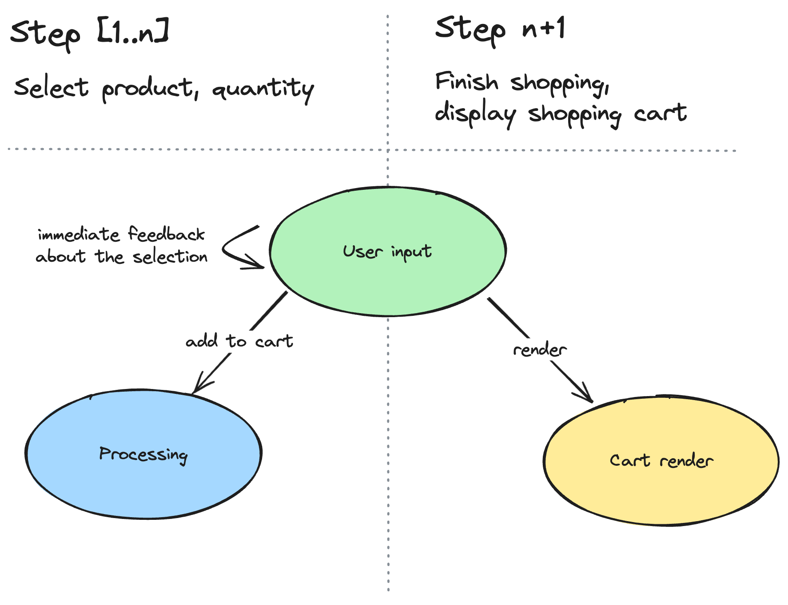
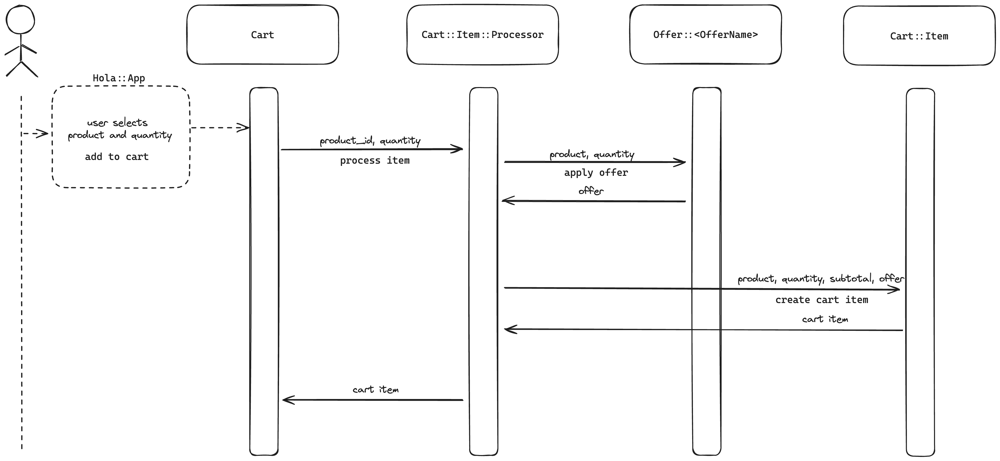

# Hola Shopping Cart 🛍️

## Challenge
> *Build an app that supports adding products to a shopping cart and displaying a total price.*
> | *Product code* | *Name*         | *Price*   |
> | -------------- | -------------- | --------- |
> | *GR1*          | *Green Tea*    | *3.11 €*  |
> | *SR1*          | *Strawberries* | *5.00 €*  |
> | *CF1*          | *Coffee*       | *11.23 €* |
> ### *Special conditions*
> * *Green Tea has buy-one-get-one-free offer*
>
> * *Strawberries price changes to 4.50€ if you buy 3 or more*
>
> * *Coffee price drops to 2/3 of the original price if you buy 3 or more*
>
> *Shopping cart can accept items in any order and be flexible regarding pricing rules.*
> ### *Test data*
>| *Basket*                  | *Total price expected* |
>| ------------------------- | ---------------------- |
>| *GR1, GR1*                | *3.11€*                |
>| *SR1, SR1, GR1, SR1*      | *16.61€*               |
>| *GR1, CF1, SR1, CF1, CF1* | *30.57€*               |


## Solution

### Hola Shopping Cart 🛍️

*Are you tired of shopping on over-designed webshops? Hola Shopping Cart is a simple, eyes-friendly CLI application to browse products and fill the shopping cart. Don't leave your favorite terminal to go shopping.*


## Installation

*Requirements: Ruby >= 3.0.0 installed*

Available as a gem through [RubyGems](https://rubygems.org/gems/hola_shopping_cart), install it:

```
$ gem install hola_shopping_cart
```

## Usage
In order to start shopping, run the command:

```
$ hola
```
Use your keyboard's Up/Down arrow keys to navigate the product list. Press Enter to select a product. Select a quantity by inserting a number. When you want to finish shopping, press `n` to see the shopping cart.

## Arhitecture
Three primary actions happen in the life cycle of the app:
* User input capture
* Processing items in a cart
* Rendering a cart to display it



### User input
The underlying library [TTY::Prompt](https://github.com/piotrmurach/tty-prompt) is used to ease up gathering user input from the command line. The library has a number of handy prompt types; one of them is `select`, which is used to show a list of available products and make a selection. The command line immediately displays a user selection for a great user experience. After that, it's up to the processing action to take over.

### Processing
Processing action is responsible for fetching necessary data, processing the product offers, and answering with `Cart::Item`. The item is then stored in the `Cart`, and processing is complete. The processing is done intentionally before adding an item to the cart to avoid big performance spikes at the end when the cart is rendered. That brings additional benefits. For example, if the product price or offer changes in the middle of the user's shopping, the total price will respect the price shown when the product is added to the cart.

Sequence diagram of processing an item:


### Cart render
The [TTY::Table](https://github.com/piotrmurach/tty-table) table formatting component is used to perform rendering. The table is rendered with an ASCII-type border.
```
+------------+------+--------+--------+------------------------+
|Item        |Price |Quantity|Subtotal|Offer                   |
+------------+------+--------+--------+------------------------+
|Green Tea   |3.11€ |1       |3.11€   |                        |
|Strawberries|5.00€ |1       |5.00€   |                        |
|Coffee      |11.23€|3       |22.46€  |Two-Thirds Bulk Discount|
+------------+------+--------+--------+------------------------+
|Total       |      |        |30.57€  |                        |
+------------+------+--------+--------+------------------------+
```

### Flexability
The architecture is designed to be flexible as much as possible when comes to adding new special offers or modifying existing ones.

To add a new special offer, we have to create a new file inside `hola/offers`. The example below shows adding a price reduction of 20%.
```ruby
module Hola
  class Offer
    class NewSpecialDiscount < Offer
      def price
        super * 0.8
      end
    end
  end
end
```
The last step is to add a newly created special offer to a product.
```ruby
product.apply_offer("NewSpecialDiscount")
```

## Tests
```
rspec ./spec
.................................................................

Finished in 0.0427 seconds (files took 0.24592 seconds to load)
109 examples, 0 failures
```